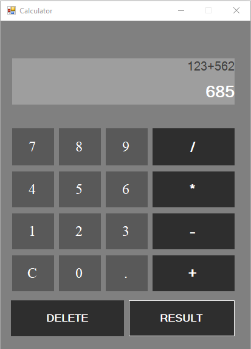
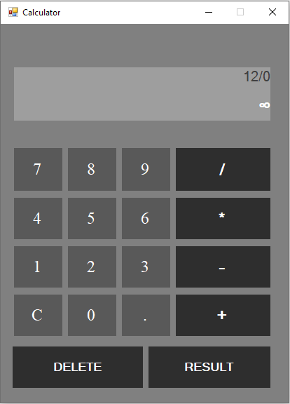
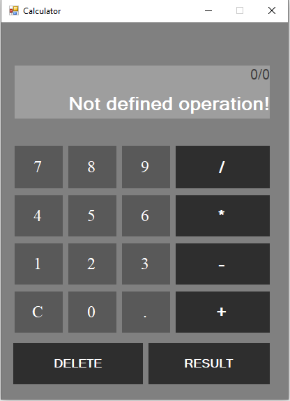
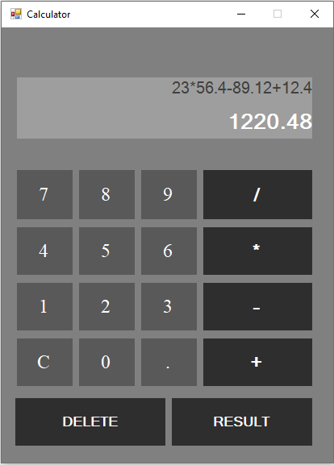
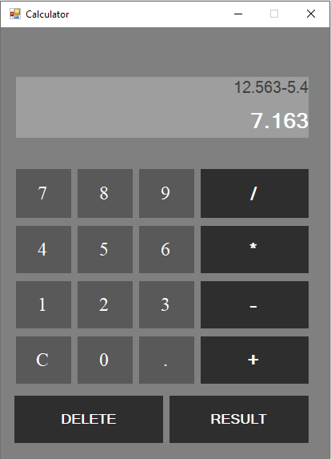

# Calculator-App using Windows Forms 

* A GUI calculator created using C# and Windows Forms(.NET Framework)

* Features:
    * You can control it using the keyboard(numerical keys and numpad keys) or the mouse(by clicking on buttons)
    * Can resolve division by 0 and 0/0 undefined operation
    
    
    
    * Can compute multiple operations at once

    
    
    * Can compute float numbers
    
    

* What I used:
    * Events handlers (KeyPress event,ButtonClick event...)
    * Windows Forms (buttons, labels, textboxes, panels)
    * OOP
    * try/catch blocks
